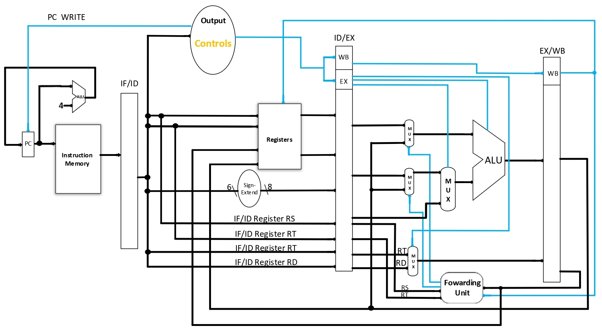

# CPU Pipeline

## Descrição do projeto
Projeto realizado para a disciplina de [Arquitetura de Computadores](https://github.com/h-ssiqueira/ProgramsCOLLEGE#AC), utilizando o software Intel Quartus Prime Lite Edition 18.1 e a linguagem VHDL. O [projeto](/PDFs/AC-Projeto3.pdf) consiste na simulação de uma unidade central de processamento (CPU) de 16 bits.

Uma CPU Pipeline realiza até 4 instruções de cada vez, sendo que cada instrução leva 4 ciclos de processamento para ser concluída, cada ciclo pertencente a um estágio de uma instrução.

A CPU consiste de 10 diferentes instruções denotadas pela tabela abaixo:

Instrução | Nome
:---: | :---:
MOV | Move
MOVI | Move imediato
ADD | Adição
ADDI | Adição imediata
SUB | Subtração
SUBI | Subtração imediata
AND | Operação lógica AND
ANDI | Operação lógica AND imediata
OR | Operação lógica OR
ORI | Operação lógica OR imediata

O [programa](/PDFs/programa.txt) utilizado na simulação é denotado de 16 instruções manipulando os 8 registradores existentes.

### Datapath

    

Para mais informações acerca do projeto consulte o [relatório](/PDFs/Relatório%20Projeto%203.pdf), a [tabela de estados](/PDFs/Tabela%20de%20estados.pdf) ou o [diagrama de estados](/PDFs/diagrama%20de%20estados.pdf).

## Executando
Para executar o projeto realize os seguintes passos:
* Abra o arquivo .QPF localizado em [quartus files](/quartus%20files/) dentro do software Intel Quartus Prime.
* Após isso selecione "Start Analysis & Elaboration".
* Tools -> Run Simulation Tool -> RTL Simulation
* Com o ModelSim aberto, no canto esquerdo do software, em libraries, selecione "work" e com o botão direito pressionado em "cpu" selecione "Simulate".
* Com as variáveis dentro do ambiente de simulação, adicione-as dentro da região de ondas com **Ctrl + W** e defina os intervalos de clock de cada variável, consulte o [relatório](/PDFs/Relatório%20Projeto%203.pdf) ou as [imagens de teste](/testes/imgs/) para definir os intervalos.
* Após a configuração dos intervalos de cada variável, execute a simulação em "Run -All"

## Autores
* [Henrique Siqueira](https://github.com/h-ssiqueira)
* [Jemis Dievas](https://github.com/jamesdievas)